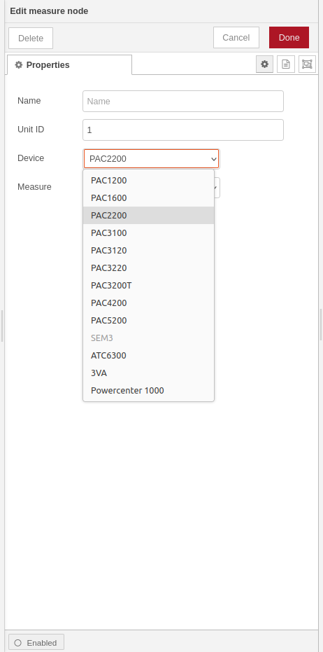
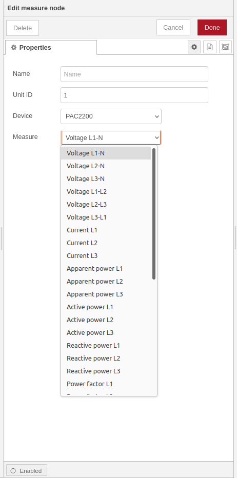
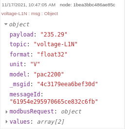
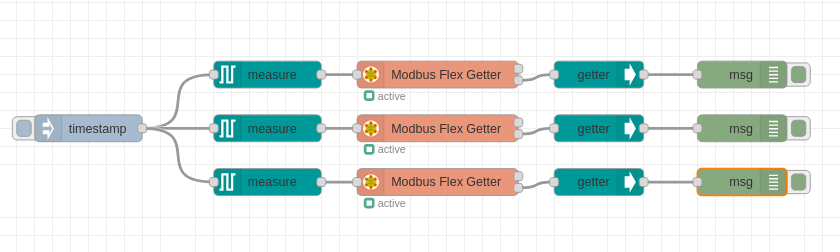

# node-red-contrib-siemens-sentron
Node-RED nodes to read electrical measures from [Siemens SENTRON](https://new.siemens.com/global/en/products/energy/low-voltage/components/sentron-measuring-devices-and-power-monitoring.html) series over Modbus TCP/IP.
## Node-RED configurator to read Siemens SENTRON series over Modbus TCP/IP
* [Install](#install)
* [How to use](#how-to-use)
* [Supported devices](#supported-devices)
* [Usage](#usage)
* [Meters data](#meters-data)
* [Equipment compatibility](#equipment-compatibility)
---

## Install
You can install these nodes directly from the **Manage Palette** menu in the [Node-RED](https://nodered.org/) interface.

Alternatively, run the following command in your Node-RED user directory - typically `~/.node-red` on Linux or `%HOMEPATH%\.nodered` on Windows

        npm install node-red-contrib-siemens-sentron
        
You must also install `node-red-contrib-modbus` directly from the **Manage Palette** menu in the Node-RED interface or run the following command in your Node-RED user directory
       
        npm install node-red-contrib-modbus
                 
## How to use

### measure node
Use the `measure` node to configure which information you want to request from the device.

Wire the output of the `measure` to the input of the `Modbus Flex Getter` from 'node-red-contrib-modbus' modules.

Enable check box `Keep Msg Properties` in the `Modbus Flex Getter` properties.

### getter node
Use the `getter` node to convert the values from the modbus response into human readable numbers.

Wire the second output of the `Modbus Flex Getter` to the input of the `getter`.

## Supported devices

### Measuring devices
+ PAC1200
+ PAC1600
+ PAC2200
+ PAC3100
+ PAC3120
+ PAC3200
+ PAC3220
+ PAC3200T
+ PAC4200
+ PAC5200
+ SEM3

### Transfer controller
+ ATC6300

### Molded case circuit breakers
+ 3VA

### Dataserver
+ 7KN Powercenter 1000

### RF devices
+ 5SL6 COM

## Usage
### Device type

### Meter data 

### Message object 

### Sample flow

## Meters data
List of **PAC2200** meter data:

| Measure                            | Units                 | Type            | 
| ---------------------------------- | --------------------- | --------------- | 
|  Voltage L1-N                      | V                     | Float 32        | 
|  Voltage L2-N                      | V                     | Float 32        |
|  Voltage L3-N                      | V                     | Float 32        |
|  Voltage L1-L2                     | V                     | Float 32        |
|  Voltage L2-L3                     | V                     | Float 32        |
|  Voltage L3-L1                     | V                     | Float 32        |
|  Current L1                        | A                     | Float 32        |
|  Current L2                        | A                     | Float 32        |
|  Current L3                        | A                     | Float 32        |
|  Apparent power L1                 | VA                    | Float 32        |
|  Apparent power L2                 | VA                    | Float 32        |
|  Apparent power L3                 | VA                    | Float 32        |
|  Active power L1                   | W                     | Float 32        |
|  Active power L2                   | W                     | Float 32        |
|  Active power L3                   | W                     | Float 32        |
|  Reactive power L1                 | var                   | Float 32        |
|  Reactive power L2                 | var                   | Float 32        |
|  Reactive power L3                 | var                   | Float 32        |
|  Power factor L1                   | -                     | Float 32        |
|  Power factor L2                   | -                     | Float 32        |
|  Power factor L3                   | -                     | Float 32        |
|  Frequency                         | Hz                    | Float 32        |
|  Average voltage L-N               | V                     | Float 32        |
|  Average voltage L-L               | V                     | Float 32        |
|  Average current                   | A                     | Float 32        |
|  Total apparent power              | VA                    | Float 32        |
|  Total active power                | W                     | Float 32        |
|  Total reactive power              | var                   | Float 32        |
|  Total power factor                | -                     | Float 32        |
|  Neutral current                   | A                     | Float 32        |
|  Active energy import              | Wh                    | Float 32        |
|  Reactive energy import            | varh                  | Float 32        |
|  Active energy export              | Wh                    | Float 32        |
|  Reactive energy export            | varh                  | Float 32        |
|  Active energy import tariff 1     | Wh                    | Double          |
|  Active energy import tariff 2     | Wh                    | Double          |
|  Active energy export tariff 1     | Wh                    | Double          |
|  Active energy export tariff 2     | Wh                    | Double          |
|  Reactive energy import tariff 1   | varh                  | Double          |
|  Reactive energy import tariff 2   | varh                  | Double          |
|  Reactive energy export tariff 1   | varh                  | Double          |
|  Reactive energy export tariff 2   | varh                  | Double          |
|  Apparent energy tariff 1          | VAh                   | Double          |
|  Apparent energy tariff 2          | VAh                   | Double          |

List of **7KN Powercenter 1000** meter data:

| Measure                            | Units                 | Type            | 
| ---------------------------------- | --------------------- | --------------- | 
|  Current temperature               | °C                    | Float 32        |   
|  Average temperature               | °C                    | Float 32        |
|  Actual current L                  | A                     | Float 32        |
|  Average current L                 | A                     | Float 32        |
|  Maximum current L                 | A                     | Float 32        |
|  L-N voltage                       | V                     | Float 32        |
|  Line frequency                    | Hz                    | Float 32        |
|  Active power L                    | W                     | Float 32        |
|  Apparent power L                  | VA                    | Float 32        |
|  Reactive power L                  | var                   | Float 32        |
|  Power factor L                    | -                     | Float 32        |
|  Imported active energy            | Wh                    | Float 64        |
|  Exported actie energy             | Wh                    | Float 64        |
|  Imported reactive energy          | varh                  | Float 64        |
|  Exported reactive energy          | varh                  | Float 64        |
|  Protection device status          | -                     | Unsigned int 16 |
|  Alarms status                     | -                     | Unsigned int 32 |
|  Mechanical operating cycles       | -                     | Float 32        |
|  Tripping operations               | -                     | Float 32        |
|  Short-circuit trips               | -                     | Float 32        |

Set unit IDs (1 .. 24) for paired circuit protection devices. 

## Equipment compatibility

These modules have been developed and tested on:
+ SENTRON PAC2200
+ 7KN Powercenter 1000 with 5SL6 COM
