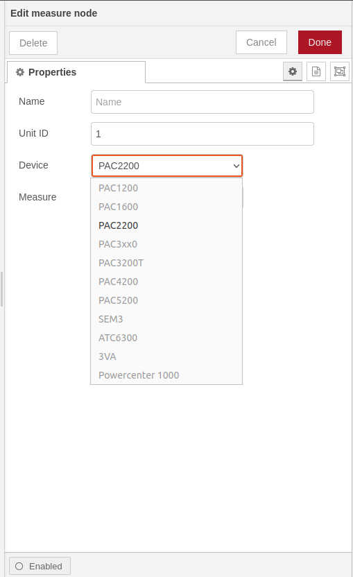

# node-red-contrib-siemens-sentron
A node-RED nodes to read electrical measures from Siemens SENTRON series over Modbus TCP/IP.
## Node-RED configurator to read Siemens SENTRON series over Modbus TCP/IP

## Install
You can install these nodes directly from the "Manage Palette" menu in the Node-RED interface.

Alternatively, run the following command in your Node-RED user directory - typically `~/.node-red` on Linux or `%HOMEPATH%\.nodered` on Windows

        npm install node-red-contrib-siemens-sentron 

## How to use

### meter node
Use the `measure` node to configure which information you want to request from the device.

Wire the output of the `measure` to the input of the `Modbus Flex Getter` from 'node-red-contrib-modbus' modules.

Enable check box `Keep Msg Properties` in the `Modbus Flex Getter` properties.

### getter node
Use the `getter` node to convert the values from the modbus response into human readable numbers.

Wire the second output of the `Modbus Flex Getter` to the input of the `getter`.

## Usage
List of **PAC2200** meter data:

| Measure                            | Units                 | Type          | 
| ---------------------------------- | --------------------- | ------------- | 
|  Voltage L1-N                      | V                     | Float         | 
|  Voltage L2-N                      | V                     | Float         |
|  Voltage L3-N                      | V                     | Float         |
|  Voltage L1-L2                     | V                     | Float         |
|  Voltage L2-L3                     | V                     | Float         |
|  Voltage L3-L1                     | V                     | Float         |
|  Current L1                        | A                     | Float         |
|  Current L2                        | A                     | Float         |
|  Current L3                        | A                     | Float         |
|  Apparent power L1                 | VA                    | Float         |
|  Apparent power L2                 | VA                    | Float         |
|  Apparent power L3                 | VA                    | Float         |
|  Active power L1                   | W                     | Float         |
|  Active power L2                   | W                     | Float         |
|  Active power L3                   | W                     | Float         |
|  Reactive power L1                 | var                   | Float         |
|  Reactive power L2                 | var                   | Float         |
|  Reactive power L3                 | var                   | Float         |
|  Power factor L1                   | -                     | Float         |
|  Power factor L2                   | -                     | Float         |
|  Power factor L3                   | -                     | Float         |
|  Frequency                         | Hz                    | Float         |
|  Average voltage L-N               | V                     | Float         |
|  Average voltage L-L               | V                     | Float         |
|  Average current                   | A                     | Float         |
|  Total apparent power              | VA                    | Float         |
|  Total active power                | W                     | Float         |
|  Total reactive power              | var                   | Float         |
|  Total power factor                | -                     | Float         |
|  Neutral current                   | A                     | Float         |
|  Active energy import              | Wh                    | Float         |
|  Reactive energy import            | varh                  | Float         |
|  Active energy export              | Wh                    | Float         |
|  Reactive energy export            | varh                  | Float         |

### Device type

### Meter data 

### Message object 

### Sample flow

## Equipment compatibility

These modules has been developed and tested on:
+ SENTRON PAC2200
